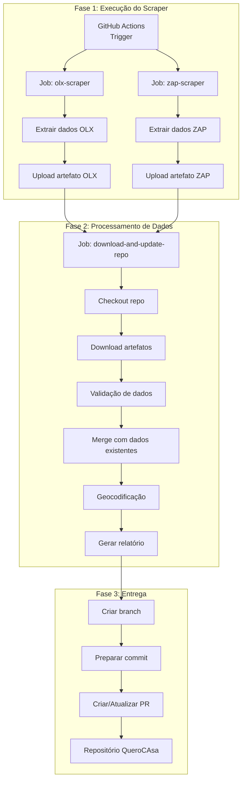
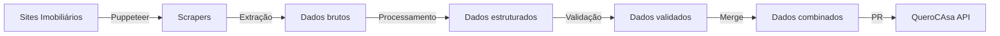
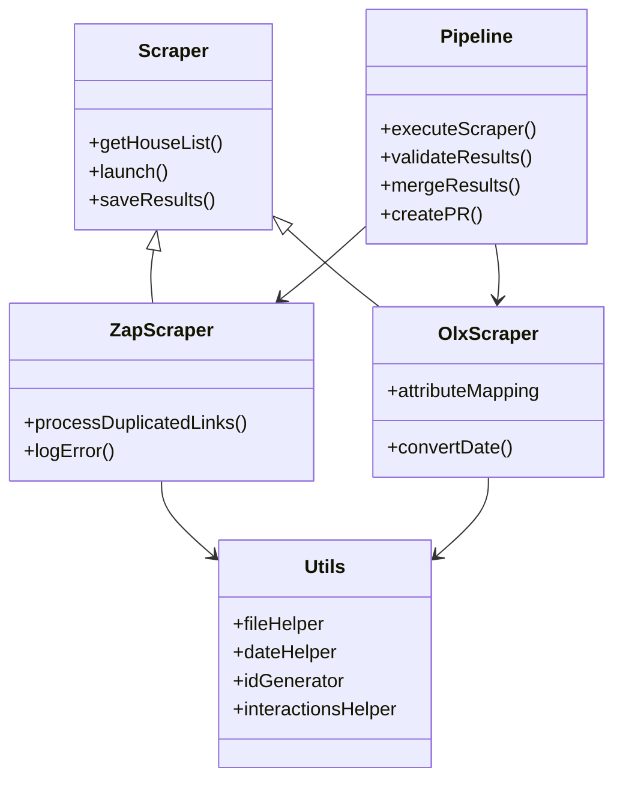

# Diagrama de Arquitetura do Sistema

```mermaid
flowchart TB
    subgraph "Fase 1: Execução do Scraper"
        A[GitHub Actions\nTrigger] --> B[Job: olx-scraper]
        A --> C[Job: zap-scraper]
        B --> D[Extrair dados OLX]
        C --> E[Extrair dados ZAP]
        D --> F[Upload artefato OLX]
        E --> G[Upload artefato ZAP]
    end
    
    subgraph "Fase 2: Processamento de Dados"
        H[Job: download-and-update-repo] --> I[Checkout repo]
        I --> J[Download artefatos]
        J --> K[Validação de dados]
        K --> L[Merge com dados existentes]
        L --> M[Geocodificação]
        M --> N[Gerar relatório]
    end
    
    subgraph "Fase 3: Entrega"
        N --> O[Criar branch]
        O --> P[Preparar commit]
        P --> Q[Criar/Atualizar PR]
        Q --> R[Repositório QueroCAsa]
    end
    
    F --> H
    G --> H
```

## Fluxo de Dados

```mermaid
flowchart LR
    A[Sites Imobiliários] -->|Puppeteer| B[Scrapers]
    B -->|Extração| C[Dados brutos]
    C -->|Processamento| D[Dados estruturados]
    D -->|Validação| E[Dados validados]
    E -->|Merge| F[Dados combinados]
    F -->|PR| G[QueroCAsa API]
```

## Componentes do Sistema

```mermaid
classDiagram
    class Scraper {
        +getHouseList()
        +launch()
        +saveResults()
    }
    class ZapScraper {
        +processDuplicatedLinks()
        +logError()
    }
    class OlxScraper {
        +convertDate()
        +attributeMapping
    }
    class Pipeline {
        +executeScraper()
        +validateResults()
        +mergeResults()
        +createPR()
    }
    class Utils {
        +fileHelper
        +dateHelper
        +idGenerator
        +interactionsHelper
    }
    
    Scraper <|-- ZapScraper
    Scraper <|-- OlxScraper
    ZapScraper --> Utils
    OlxScraper --> Utils
    Pipeline --> ZapScraper
    Pipeline --> OlxScraper
```